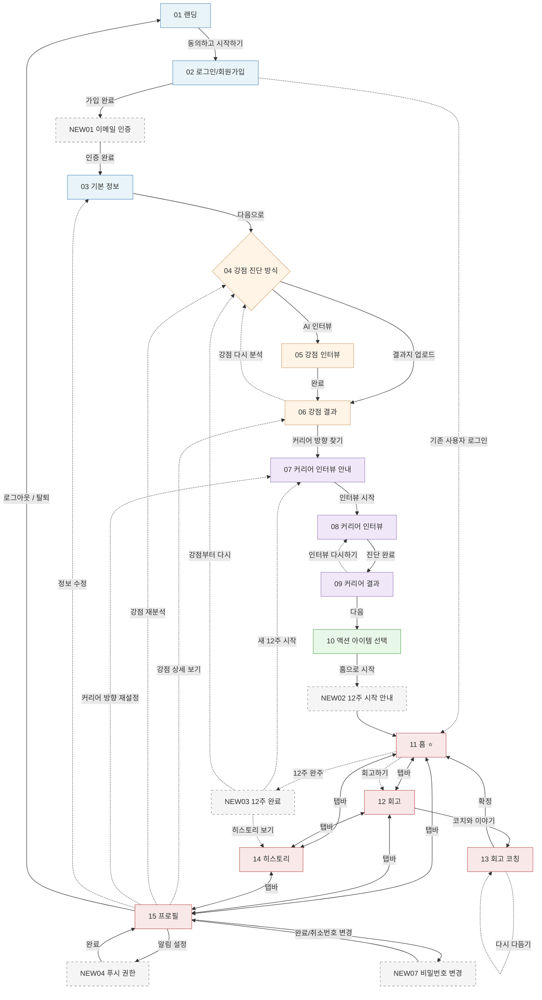

# CareerPT 전체 화면 플로우

> 22개 화면(기존 15개 + 신규 7개)의 진입·전환·복귀 흐름 정리.
> Common 기획(v1.1) 기준 5번 항목(유저 플로우)의 상세 확장판.

## 0. 화면 정의

### 기존 화면 (Common v1.1)

| ID | 화면명 | 페이즈 | 한 줄 정의 |
|---|---|---|---|
| 01 | 랜딩 / 코칭 합의 | ONBOARDING | 코칭 원칙(고객 주도·강점 기반·코칭 범위) 안내 및 동의 |
| 02 | 로그인 / 회원가입 | ONBOARDING | 계정 생성 또는 로그인 (Supabase Auth) |
| 03 | 기본 정보 입력 | ONBOARDING | 이름·나이대·직군·고민 등 기본 프로필 수집 |
| 04 | 강점 진단 방식 선택 | DISCOVER | AI 인터뷰 vs 갤럽 결과지 업로드 경로 분기 |
| 05 | 강점 인터뷰 (AI 채팅) | DISCOVER | AI 코치와 대화로 강점 테마 탐색 |
| 06 | 강점 결과 | DISCOVER | 갤럽 34 테마 중 상위 강점 Top 5 제시 |
| 07 | 커리어 인터뷰 인트로 | DIRECTION | 강점 → 커리어 방향 탐색 전환 안내 |
| 08 | 커리어 인터뷰 (AI 채팅) | DIRECTION | 강점 컨텍스트 기반 커리어 방향 AI 탐색 |
| 09 | 커리어 방향 결과 | DIRECTION | 커리어 방향(목표 역량) 후보 5개 제시 및 선택 |
| 10 | 액션 아이템 선택 | DO | 선택 방향 기반 실행 과제 선택 + 12주 코칭 시작 |
| 11 | 홈 (12주 대시보드) | MAINTAIN | 12주 코칭 현황·오늘의 액션·타임라인 확인 |
| 12 | 회고 | MAINTAIN | 평일 메모 작성 및 주말 주간 회고 완성 |
| 13 | 회고 코칭 (AI 채팅) | MAINTAIN | 주간 회고 기반 AI 코칭 대화 및 인사이트 도출 |
| 14 | 히스토리 | MAINTAIN | 과거 강점·커리어·액션·패턴 아카이브 조회 |
| 15 | 프로필 | MAINTAIN | 강점 요약·기본정보 수정·알림 설정·로그아웃 |

### 신규 화면 (페이지별 스펙에서 추가)

| ID | 화면명 | 페이즈 | 한 줄 정의 |
|---|---|---|---|
| NEW01 | 이메일 인증 안내 | ONBOARDING | 회원가입 후 이메일 인증 메일 확인·재발송 |
| NEW02 | 12주 여정 시작 안내 | DO | 10 직후 1회 노출되는 시작 동기 부여 화면 |
| NEW03 | 12주 완료 화면 | CYCLE END | 12주 완주 축하 + 다음 사이클 진입 유도 |
| NEW04 | 푸시 알림 권한 요청 | MAINTAIN | 15 프로필 알림 설정에서 진입, 코칭 일정 알림용 푸시 권한 요청 |
| NEW05 | 네트워크 오류 화면 | ERROR | 서버/네트워크 연결 실패 시 안내 + 재시도 |
| NEW06 | 일반 오류 화면 | ERROR | 404/런타임 오류 통합 fallback 화면 |
| NEW07 | 비밀번호 변경 | MAINTAIN | 15 프로필에서 진입, 현재 비밀번호 재인증 후 새 비밀번호 설정 |

## 1. 메인 플로우 (Happy Path)

가입부터 12주 코칭 진행까지의 정상 흐름.

```
01 랜딩 (코칭 합의)
  └─ [동의하고 시작하기] ─→ 02

02 로그인 / 회원가입
  ├─ [회원가입 완료] ─→ NEW01 이메일 인증 ─→ 03
  ├─ [로그인 / Google 로그인] ─→ (사용자 상태 기반 라우팅)
  └─ [기존 진행 중 사용자] ─→ 03 / 11 / NEW03 중 분기

03 기본 정보 입력
  └─ [다음으로] ─→ 04

04 강점 진단 방식 선택 ⚡ 분기점
  ├─ [AI 인터뷰 선택] ─→ 05
  └─ [갤럽 결과지 업로드] ─→ 06 (파싱 성공 시 직행)

05 강점 인터뷰 (AI 대화)
  └─ [완료] ─→ 06

06 강점 결과
  ├─ [커리어 방향 찾기로] ─→ 07
  └─ [강점 분석 다시하기] ─→ 04

07 커리어 인터뷰 안내
  └─ [인터뷰 시작하기] ─→ 08

08 커리어 인터뷰 (AI 대화)
  └─ [진단 완료하기] ─→ 09

09 커리어 결과 / 방향 선택
  ├─ [다음] ─→ 10
  └─ [커리어 인터뷰 다시하기] ─→ 08

10 액션 아이템 선택
  └─ [홈으로 시작하기] ─→ NEW02 12주 시작 안내 ─→ 11

11 홈 ⭐ 메인 허브
  ├─ 탭바: 12 회고 · 14 히스토리 · 15 프로필
  ├─ 타임라인 [회고하기 버튼] ─→ 12
  ├─ 헤더 [프로필 아이콘] ─→ 15
  └─ [12주 완주 시 자동] ─→ NEW03 12주 완료 화면

12 회고
  ├─ 탭바: 11 · 14 · 15
  ├─ [코치와 이야기 나누기] ─→ 13
  └─ [회고 코칭 미리 카드] ─→ 13

13 회고 코칭 (AI 대화)
  ├─ [✓ 맞아요] ─→ 11
  └─ [← 다시 다듬기] ─→ 13 내부 복귀 (인터뷰 추가)

14 히스토리
  └─ 탭바: 11 · 12 · 15

15 프로필
  ├─ 탭바: 11 · 12 · 14
  ├─ [강점 상세 결과 보기] ─→ 06 (읽기 전용 모드)
  ├─ [강점 다시 분석하기] ─→ 04
  ├─ [커리어 방향 재설정] ─→ 07
  ├─ [알림 설정] ─→ NEW04 푸시 알림 권한 화면
  ├─ [비밀번호 변경] ─→ NEW07 비밀번호 변경 화면
  ├─ [정보 수정] ─→ 03 (기본정보 수정 모드)
  ├─ [로그아웃] ─→ 01
  └─ [회원 탈퇴] ─→ 01

NEW04 푸시 알림 권한 (15에서 진입)
  ├─ [알림 받기] ─→ 권한 허용 후 15 복귀
  └─ [나중에] ─→ 15 복귀

NEW07 비밀번호 변경 (15에서 진입)
  ├─ [비밀번호 변경] ─→ 변경 성공 → 15 복귀 (다른 디바이스 자동 로그아웃)
  └─ [취소 / 뒤로가기] ─→ 15 복귀
```

## 2. Mermaid 다이어그램

GitHub, Notion, VS Code 등에서 자동 렌더링됨.



## 3. 사용자 상태별 진입 라우팅

01 랜딩 또는 02 로그인 진입 시 사용자 상태에 따른 라우팅 결정.

| 사용자 상태 | 조건 | 진입 화면 |
|---|---|---|
| 비로그인 | 세션 없음 | 01 랜딩 |
| 이메일 미인증 | `email_confirmed_at IS NULL` | NEW01 이메일 인증 |
| 기본 정보 미완 | `profiles.profile_completed = false` | 03 기본 정보 |
| 강점 미분석 | `strength_analyses` (is_latest=true) 없음 | 04 강점 진단 방식 선택 |
| 커리어 미분석 | `goals` 없음 | 07 커리어 인터뷰 안내 |
| 액션 미선택 | `action_items` (week_number=1) 없음 | 10 액션 아이템 선택 |
| 코칭 진행 중 | `goals.status = 'active'` 또는 `'paused'` | 11 홈 |
| 12주 완주 | `goals.status = 'completed'` | NEW03 12주 완료 |

> 본 라우팅 표는 v1.1에서 실제 Supabase 스키마(`profiles`, `strength_analyses`, `goals`, `action_items`)에 맞춰 검증된 버전. 페이지별 스펙 문서의 컬럼 표기도 점진적으로 본 스키마에 맞춰 정렬 예정.

## 4. 페이즈별 그룹

Common 기획서의 페이즈 정의에 따른 화면 묶음.

| 페이즈 | 화면 | 역할 |
|---|---|---|
| **ONBOARDING** | 01, 02, NEW01, 03 | 진입·인증·기본정보 |
| **DISCOVER** | 04, 05, 06 | 강점 발견 |
| **DIRECTION** | 07, 08, 09 | 커리어 방향 |
| **DO** | 10, NEW02 | 12주 시작 준비 |
| **MAINTAIN** | 11, 12, 13, 14, 15, NEW04, NEW07 | 매일·매주 코칭 유지 + 알림 설정 + 비밀번호 변경 |
| **CYCLE END** | NEW03 | 12주 완료, 다음 사이클 진입 |
| **ERROR** | NEW05, NEW06 | 모든 화면에서 발생 가능 |

## 5. 분기점 (의사결정이 필요한 화면)

| 화면 | 분기 종류 | 옵션 |
|---|---|---|
| 02 로그인/회원가입 | 신규 vs 기존 | 가입 → NEW01 / 로그인 → 상태별 라우팅 |
| 04 강점 진단 | 진단 경로 | AI 인터뷰(05) vs 갤럽 결과지 업로드(06 직행) |
| 06 강점 결과 | 진행 vs 재시도 | 다음(07) / 다시 분석(04) |
| 09 커리어 결과 | 진행 vs 재시도 | 다음(10) / 다시 인터뷰(08) |
| 13 회고 코칭 | 확정 vs 보완 | 확정(11) / 다시 다듬기(13 내부) |
| NEW03 12주 완료 | 다음 사이클 | 새 12주(07) / 강점부터(04) / 히스토리(14) |

## 6. 재방문 / 재진입 시나리오

15 프로필에서 사용자가 능동적으로 다시 시작하는 경로.

| 시작 화면 | 액션 | 재진입 경로 |
|---|---|---|
| 15 | 강점 상세 결과 보기 | 06 (읽기 전용) → 15 복귀 |
| 15 | 강점 다시 분석 | 04 → (05 또는 06 직행) → 06 → 15 복귀 (현재 사이클 유지, 새 `strength_analyses` row가 `is_latest=true`로 갱신) |
| 15 | 커리어 방향 재설정 | 확인 다이얼로그 → 기존 사이클 중단(`goals.status='abandoned'`) → 07 → 08 → 09 → 10 → NEW02 → 11 (W1부터 새 사이클) |
| 15 | 정보 수정 | 03 (수정 모드) → 15 복귀 |
| 15 | 알림 설정 | NEW04 푸시 알림 권한 → 15 복귀 |
| 15 | 비밀번호 변경 | NEW07 비밀번호 변경 → 15 복귀 (다른 디바이스 자동 로그아웃) |
| 15 | 로그아웃 | 01 |
| 15 | 회원 탈퇴 | 01 (모든 데이터 삭제 후) |
| NEW03 | (선택) 기본 정보 점검 | 03 (수정 모드) → NEW03 복귀 |
| NEW03 | 새 12주 시작 | 07 → 08 → 09 → 10 → NEW02 → 11 (강점은 유지, 새 `goals` 생성으로 NEW02 1회 재노출) |
| NEW03 | 강점부터 다시 | 04 → ... → 10 → NEW02 → 11 |

## 7. 에러 화면 진입

NEW05·NEW06은 어떤 화면에서도 발생 가능. 복귀는 사용자 상태에 따라 분기.

```
[모든 화면]
  ├─ 네트워크 실패 / 5xx ─→ NEW05 ─→ [다시 시도] → 원래 화면 복귀
  └─ 404 / JS 런타임 오류 ─→ NEW06 ─→ [홈으로] → 사용자 상태에 맞는 홈으로
```

## 8. 결정 사항

진행 중 결정된 운영 정책 정리.

- **NEW04 푸시 권한**: ✅ 15 프로필 → [알림 설정] 버튼 진입으로 결정 (NEW02 직후 강제 노출 안 함)
- **재방문 시 NEW02 노출 여부**: ✅ 1회 한정 — 10 액션 선택 직후 1회만 노출, 재로그인 시 11 홈으로 직행
  - 구현: 새 `goals` 생성 시점 기준으로 NEW02 1회 노출 (이후 재진입 시 11 홈으로 직행)
- **15 프로필의 "커리어 방향 재설정"**: ✅ 기존 사이클 종료 + 새 사이클 시작 (강제 새로 선택)
  - 흐름: 15 → 확인 다이얼로그 → 07 → 08 → 09 → 10 (새 액션 선택 강제) → NEW02 → 11 (W1부터 다시)
  - 안내 문구: "현재 사이클이 종료되고 새 사이클이 시작돼요. 지금까지 데이터는 히스토리에 보관돼요"
  - 데이터 처리: 기존 `goals.status = 'abandoned'` 처리 (사용자 의도적 중단), 새 `goals` 생성
- **NEW03 → 새 12주 진입 시 03 기본 정보 재방문**: ✅ 옵션 제공 (강제 X, 권장 O)
  - NEW03 화면에 "기본 정보 점검" 보조 카드 노출
  - 클릭 시 03 (수정 모드)으로 진입, 수정 완료 후 NEW03로 복귀
  - 기본 흐름은 NEW03 → 07 그대로 유지
- **NEW07 비밀번호 변경**: ✅ 별도 화면으로 진행 (모달 X)
  - 모바일에서 입력 필드·키보드 가림 문제, 패스워드 매니저 호환, 다른 화면 패턴(03/04/07) 일관성 고려
  - 변경 성공 시 현재 세션 유지 + 다른 디바이스만 자동 로그아웃

---

## 변경 이력

| 버전 | 날짜 | 변경 내용 |
| --- | --- | --- |
| v1.3 | 2026-05-05 | 커리어 방향 재설정 시 `goals.status` 값 정렬: `'completed'` → `'abandoned'` (사용자 의도적 중단이므로 의미상 더 정확). 6번 재방문 시나리오 표 + 8번 결정 사항 두 곳 반영. 15_profile.md v1.1과 정렬. |
| v1.2 | 2026-05-05 | 0번 화면 정의 추가 / NEW07 비밀번호 변경 화면 신규 / NEW04 진입 위치 변경(NEW02 직후 → 15 프로필 알림 설정) / 15 프로필 분기 확장(강점 상세, 정보 수정, 알림 설정, 비밀번호 변경) / "커리어 재인터뷰" → "커리어 방향 재설정" 명칭 통일 / 8번 미결사항 → 결정사항으로 정리 / 재방문 시나리오 확장 |
| v1.1 | 2026-05-05 | schema 검증 반영: 사용자 상태별 라우팅 조건 수정 (`basic_info_completed_at`→`profiles.profile_completed`, `strength_results`→`strength_analyses is_latest`, `career_results.selected_direction`→`goals`, `coaching_start_at + 84일`→`goals.status='completed'`) |
| v1.0 | 2026-05-04 | 최초 작성 |
