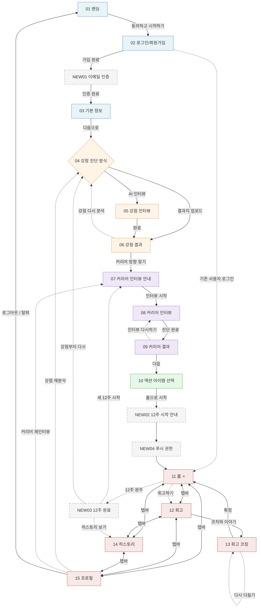

# CareerPT 전체 화면 플로우

> 21개 화면(기존 15개 + 신규 6개)의 진입·전환·복귀 흐름 정리. 

## 1. 메인 플로우 

가입부터 12주 코칭 진행까지의 정상 흐름.

```
01 랜딩 (코칭 합의)
  └─ [동의하고 시작하기] ─→ 02

02 로그인 / 회원가입
  ├─ [회원가입 완료] ─→ NEW01 이메일 인증 ─→ 03
  ├─ [로그인 / Google 로그인] ─→ (사용자 상태 기반 라우팅)
  └─ [기존 진행 중 사용자] ─→ 03 / 11 / NEW03 중 분기

03 기본 정보 입력
  └─ [다음으로] ─→ 04

04 강점 진단 방식 선택 ⚡ 분기점
  ├─ [AI 인터뷰 선택] ─→ 05
  └─ [갤럽 결과지 업로드] ─→ 06 (파싱 성공 시 직행)

05 강점 인터뷰 (AI 대화)
  └─ [완료] ─→ 06

06 강점 결과
  ├─ [커리어 방향 찾기로] ─→ 07
  └─ [강점 분석 다시하기] ─→ 04

07 커리어 인터뷰 안내
  └─ [인터뷰 시작하기] ─→ 08

08 커리어 인터뷰 (AI 대화)
  └─ [진단 완료하기] ─→ 09

09 커리어 결과 / 방향 선택
  ├─ [다음] ─→ 10
  └─ [커리어 인터뷰 다시하기] ─→ 08

10 액션 아이템 선택
  └─ [홈으로 시작하기] ─→ NEW02 12주 시작 안내 ─→ NEW04 푸시 권한 ─→ 11

11 홈 ⭐ 메인 허브
  ├─ 탭바: 12 회고 · 14 히스토리 · 15 프로필
  ├─ 타임라인 [회고하기 버튼] ─→ 12
  ├─ 헤더 [프로필 아이콘] ─→ 15
  └─ [12주 완주 시 자동] ─→ NEW03 12주 완료 화면

12 회고
  ├─ 탭바: 11 · 14 · 15
  ├─ [코치와 이야기 나누기] ─→ 13
  └─ [회고 코칭 미리 카드] ─→ 13

13 회고 코칭 (AI 대화)
  ├─ [✓ 맞아요] ─→ 11
  └─ [← 다시 다듬기] ─→ 13 내부 복귀 (인터뷰 추가)

14 히스토리
  └─ 탭바: 11 · 12 · 15

15 프로필
  ├─ 탭바: 11 · 12 · 14
  ├─ [강점 다시 분석하기] ─→ 04
  ├─ [커리어 재인터뷰] ─→ 07
  ├─ [로그아웃] ─→ 01
  └─ [회원 탈퇴] ─→ 01
```

## 2. Mermaid 다이어그램

GitHub, Notion, VS Code 등에서 자동 렌더링됨.



## 3. 사용자 상태별 진입 라우팅

01 랜딩 또는 02 로그인 진입 시 사용자 상태에 따른 라우팅 결정.

| 사용자 상태 | 조건 | 진입 화면 |
|---|---|---|
| 비로그인 | 세션 없음 | 01 랜딩 |
| 이메일 미인증 | `email_confirmed_at IS NULL` | NEW01 이메일 인증 |
| 기본 정보 미완 | `basic_info_completed_at IS NULL` | 03 기본 정보 |
| 강점 미분석 | `strength_results 없음` | 04 강점 진단 방식 선택 |
| 커리어 미분석 | `career_results.selected_direction 없음` | 07 커리어 인터뷰 안내 |
| 액션 미선택 | `action_items 없음` | 10 액션 아이템 선택 |
| 코칭 진행 중 | `coaching_start_at IS NOT NULL` 그리고 12주 미경과 | 11 홈 |
| 12주 완주 | `coaching_start_at`으로부터 84일 경과 | NEW03 12주 완료 |

## 4. 페이즈별 그룹

Common 기획서의 페이즈 정의에 따른 화면 묶음.

| 페이즈 | 화면 | 역할 |
|---|---|---|
| **ONBOARDING** | 01, 02, NEW01, 03 | 진입·인증·기본정보 |
| **DISCOVER** | 04, 05, 06 | 강점 발견 |
| **DIRECTION** | 07, 08, 09 | 커리어 방향 |
| **DO** | 10, NEW02, NEW04 | 12주 시작 준비 |
| **MAINTAIN** | 11, 12, 13, 14, 15 | 매일·매주 코칭 유지 |
| **CYCLE END** | NEW03 | 12주 완료, 다음 사이클 진입 |
| **ERROR** | NEW05, NEW06 | 모든 화면에서 발생 가능 |

## 5. 분기점 (의사결정이 필요한 화면)

| 화면 | 분기 종류 | 옵션 |
|---|---|---|
| 02 로그인/회원가입 | 신규 vs 기존 | 가입 → NEW01 / 로그인 → 상태별 라우팅 |
| 04 강점 진단 | 진단 경로 | AI 인터뷰(05) vs 갤럽 결과지 업로드(06 직행) |
| 06 강점 결과 | 진행 vs 재시도 | 다음(07) / 다시 분석(04) |
| 09 커리어 결과 | 진행 vs 재시도 | 다음(10) / 다시 인터뷰(08) |
| 13 회고 코칭 | 확정 vs 보완 | 확정(11) / 다시 다듬기(13 내부) |
| NEW03 12주 완료 | 다음 사이클 | 새 12주(07) / 강점부터(04) / 히스토리(14) |

## 6. 재방문 / 재진입 시나리오

15 프로필에서 사용자가 능동적으로 다시 시작하는 경로.

| 시작 화면 | 액션 | 재진입 경로 |
|---|---|---|
| 15 | 강점 다시 분석 | 04 → (05 또는 06 직행) → 06 → 11 |
| 15 | 커리어 재인터뷰 | 07 → 08 → 09 → 11 (10은 건너뜀, 기존 액션 유지) |
| 15 | 로그아웃 | 01 |
| 15 | 회원 탈퇴 | 01 (모든 데이터 삭제 후) |
| NEW03 | 새 12주 시작 | 07 → 08 → 09 → 10 → NEW02 → 11 (강점은 유지) |
| NEW03 | 강점부터 다시 | 04 → ... → 11 |

## 7. 에러 화면 진입

NEW05·NEW06은 어떤 화면에서도 발생 가능. 복귀는 사용자 상태에 따라 분기.

```
[모든 화면]
  ├─ 네트워크 실패 / 5xx ─→ NEW05 ─→ [다시 시도] → 원래 화면 복귀
  └─ 404 / JS 런타임 오류 ─→ NEW06 ─→ [홈으로] → 사용자 상태에 맞는 홈으로
```

## 8. 미결 사항

다음 항목은 디자인팀·기획팀 협의 필요.

- **NEW04 푸시 권한**: NEW02 직후 강제 노출 vs 11 첫 진입 시 노출 — 어느 시점이 적절한지
- **재방문 시 NEW02 노출 여부**: 사용자가 로그아웃 후 재로그인할 때 NEW02를 다시 보여줄지
- **15 프로필의 "커리어 재인터뷰"**: 기존 액션(10)을 유지할지, 새로 선택하게 할지
- **NEW03 → 새 12주 진입 시 03 기본 정보**: 직군이 바뀌었을 수도 있는데 03 재진입 옵션 제공할지
